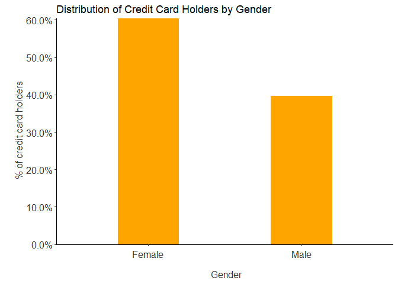
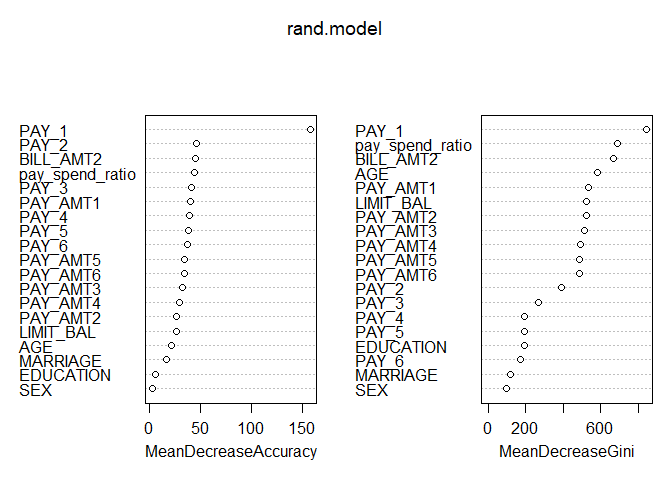

Taiwan Credit Default Analysis
================
Avani Sharma
3 September 2018

### Loading libraries & data

``` r
# Installing and loading the following libraries
packages <- c("readxl","data.table","cowplot","grid","caret","randomForest","e1071",
              "dplyr","pROC","ROCR","ggthemes","ggplot2","RColorBrewer","scales","glmnet")

lapply(packages, library, character.only = TRUE)
```

    ## Loading required package: ggplot2

    ## 
    ## Attaching package: 'cowplot'

    ## The following object is masked from 'package:ggplot2':
    ## 
    ##     ggsave

    ## Loading required package: lattice

    ## randomForest 4.6-14

    ## Type rfNews() to see new features/changes/bug fixes.

    ## 
    ## Attaching package: 'randomForest'

    ## The following object is masked from 'package:ggplot2':
    ## 
    ##     margin

    ## 
    ## Attaching package: 'dplyr'

    ## The following object is masked from 'package:randomForest':
    ## 
    ##     combine

    ## The following objects are masked from 'package:data.table':
    ## 
    ##     between, first, last

    ## The following objects are masked from 'package:stats':
    ## 
    ##     filter, lag

    ## The following objects are masked from 'package:base':
    ## 
    ##     intersect, setdiff, setequal, union

    ## Type 'citation("pROC")' for a citation.

    ## 
    ## Attaching package: 'pROC'

    ## The following objects are masked from 'package:stats':
    ## 
    ##     cov, smooth, var

    ## Loading required package: gplots

    ## 
    ## Attaching package: 'gplots'

    ## The following object is masked from 'package:stats':
    ## 
    ##     lowess

    ## 
    ## Attaching package: 'ggthemes'

    ## The following object is masked from 'package:cowplot':
    ## 
    ##     theme_map

    ## Loading required package: Matrix

    ## Loading required package: foreach

    ## Loaded glmnet 2.0-16

    ## 
    ## Attaching package: 'glmnet'

    ## The following object is masked from 'package:pROC':
    ## 
    ##     auc

    ## [[1]]
    ## [1] "readxl"    "stats"     "graphics"  "grDevices" "utils"     "datasets" 
    ## [7] "methods"   "base"     
    ## 
    ## [[2]]
    ## [1] "data.table" "readxl"     "stats"      "graphics"   "grDevices" 
    ## [6] "utils"      "datasets"   "methods"    "base"      
    ## 
    ## [[3]]
    ##  [1] "cowplot"    "ggplot2"    "data.table" "readxl"     "stats"     
    ##  [6] "graphics"   "grDevices"  "utils"      "datasets"   "methods"   
    ## [11] "base"      
    ## 
    ## [[4]]
    ##  [1] "grid"       "cowplot"    "ggplot2"    "data.table" "readxl"    
    ##  [6] "stats"      "graphics"   "grDevices"  "utils"      "datasets"  
    ## [11] "methods"    "base"      
    ## 
    ## [[5]]
    ##  [1] "caret"      "lattice"    "grid"       "cowplot"    "ggplot2"   
    ##  [6] "data.table" "readxl"     "stats"      "graphics"   "grDevices" 
    ## [11] "utils"      "datasets"   "methods"    "base"      
    ## 
    ## [[6]]
    ##  [1] "randomForest" "caret"        "lattice"      "grid"        
    ##  [5] "cowplot"      "ggplot2"      "data.table"   "readxl"      
    ##  [9] "stats"        "graphics"     "grDevices"    "utils"       
    ## [13] "datasets"     "methods"      "base"        
    ## 
    ## [[7]]
    ##  [1] "e1071"        "randomForest" "caret"        "lattice"     
    ##  [5] "grid"         "cowplot"      "ggplot2"      "data.table"  
    ##  [9] "readxl"       "stats"        "graphics"     "grDevices"   
    ## [13] "utils"        "datasets"     "methods"      "base"        
    ## 
    ## [[8]]
    ##  [1] "dplyr"        "e1071"        "randomForest" "caret"       
    ##  [5] "lattice"      "grid"         "cowplot"      "ggplot2"     
    ##  [9] "data.table"   "readxl"       "stats"        "graphics"    
    ## [13] "grDevices"    "utils"        "datasets"     "methods"     
    ## [17] "base"        
    ## 
    ## [[9]]
    ##  [1] "pROC"         "dplyr"        "e1071"        "randomForest"
    ##  [5] "caret"        "lattice"      "grid"         "cowplot"     
    ##  [9] "ggplot2"      "data.table"   "readxl"       "stats"       
    ## [13] "graphics"     "grDevices"    "utils"        "datasets"    
    ## [17] "methods"      "base"        
    ## 
    ## [[10]]
    ##  [1] "ROCR"         "gplots"       "pROC"         "dplyr"       
    ##  [5] "e1071"        "randomForest" "caret"        "lattice"     
    ##  [9] "grid"         "cowplot"      "ggplot2"      "data.table"  
    ## [13] "readxl"       "stats"        "graphics"     "grDevices"   
    ## [17] "utils"        "datasets"     "methods"      "base"        
    ## 
    ## [[11]]
    ##  [1] "ggthemes"     "ROCR"         "gplots"       "pROC"        
    ##  [5] "dplyr"        "e1071"        "randomForest" "caret"       
    ##  [9] "lattice"      "grid"         "cowplot"      "ggplot2"     
    ## [13] "data.table"   "readxl"       "stats"        "graphics"    
    ## [17] "grDevices"    "utils"        "datasets"     "methods"     
    ## [21] "base"        
    ## 
    ## [[12]]
    ##  [1] "ggthemes"     "ROCR"         "gplots"       "pROC"        
    ##  [5] "dplyr"        "e1071"        "randomForest" "caret"       
    ##  [9] "lattice"      "grid"         "cowplot"      "ggplot2"     
    ## [13] "data.table"   "readxl"       "stats"        "graphics"    
    ## [17] "grDevices"    "utils"        "datasets"     "methods"     
    ## [21] "base"        
    ## 
    ## [[13]]
    ##  [1] "RColorBrewer" "ggthemes"     "ROCR"         "gplots"      
    ##  [5] "pROC"         "dplyr"        "e1071"        "randomForest"
    ##  [9] "caret"        "lattice"      "grid"         "cowplot"     
    ## [13] "ggplot2"      "data.table"   "readxl"       "stats"       
    ## [17] "graphics"     "grDevices"    "utils"        "datasets"    
    ## [21] "methods"      "base"        
    ## 
    ## [[14]]
    ##  [1] "scales"       "RColorBrewer" "ggthemes"     "ROCR"        
    ##  [5] "gplots"       "pROC"         "dplyr"        "e1071"       
    ##  [9] "randomForest" "caret"        "lattice"      "grid"        
    ## [13] "cowplot"      "ggplot2"      "data.table"   "readxl"      
    ## [17] "stats"        "graphics"     "grDevices"    "utils"       
    ## [21] "datasets"     "methods"      "base"        
    ## 
    ## [[15]]
    ##  [1] "glmnet"       "foreach"      "Matrix"       "scales"      
    ##  [5] "RColorBrewer" "ggthemes"     "ROCR"         "gplots"      
    ##  [9] "pROC"         "dplyr"        "e1071"        "randomForest"
    ## [13] "caret"        "lattice"      "grid"         "cowplot"     
    ## [17] "ggplot2"      "data.table"   "readxl"       "stats"       
    ## [21] "graphics"     "grDevices"    "utils"        "datasets"    
    ## [25] "methods"      "base"

``` r
# Set the working directory and load data.
banking_data <- read.csv('Data/Taiwan_credit_default_data_final_v1.csv')

# Make a copy of the data for analysis.
data_u<-data.table(banking_data)
```

### Exploratory Data Analysis

``` r
#1. Demographics data - Age, Sex, Education and marital status

theme_set(theme_classic())

# Plotting % of credit card holders by education
x<-data_u[,.(count=.N/nrow(data_u)), by=EDUCATION] [order(-count)]
g1<-ggplot(x, aes(x=reorder(EDUCATION,-count),y=count, fill=EDUCATION))+
  geom_bar(stat="identity",width = 0.4, fill ="turquoise")+
  labs(title="Distribution of Credit Card Holders by Education")+
  theme_classic()+
  theme(axis.text.x = element_text(colour="grey20",size=12,angle=0,hjust=0.5,vjust=0.2),
        axis.text.y = element_text(colour="grey20",size=12,angle=0),
        axis.title.x = element_text(colour="grey20",size=12,hjust=0.5),
        axis.title.y = element_text(colour="grey20",size=12,hjust=0.5))+
  ylab("\n % of credit card holders")+ xlab("\n Education")+ 
  scale_y_continuous(expand = c(0,0),labels=scales::percent)
plot(g1)
```


``` r
# Plotting % of credit card holders by gender
y<-data_u[,.(count=.N/nrow(data_u)), by=SEX] [order(-count)]
g2<-ggplot(y, aes(x=SEX,y=count, fill=SEX))+
  geom_bar(stat="identity",width = 0.4, fill ="#ffa500")+
  labs(title="Distribution of Credit Card Holders by Gender")+
  theme_classic()+
  theme(axis.text.x = element_text(colour="grey20",size=12,angle=0,hjust=0.5,vjust=0.2),
        axis.text.y = element_text(colour="grey20",size=12,angle=0),
        axis.title.x = element_text(colour="grey20",size=12,hjust=0.5),
        axis.title.y = element_text(colour="grey20",size=12,hjust=0.5))+
  ylab("\n % of credit card holders")+ xlab("\n Gender")+ 
  scale_y_continuous(expand = c(0,0),labels=scales::percent)
plot(g2)
```



``` r
# Plotting % of credit card holders by marital status
z<-data_u[,.(count=.N/nrow(data_u)), by=MARRIAGE] [order(-count)]
g3<-ggplot(z, aes(x=reorder(MARRIAGE,-count),count,fill=MARRIAGE))+
  geom_bar(stat="identity",width = 0.4, fill ="#01579B")+
  labs(title="Distribution of Credit Card Holders by Marital Status")+
  theme_classic()+
  theme(axis.text.x = element_text(colour="grey20",size=12,angle=0,hjust=0.5,vjust=0.2),
        axis.text.y = element_text(colour="grey20",size=12,angle=0),
        axis.title.x = element_text(colour="grey20",size=12,hjust=0.5),
        axis.title.y = element_text(colour="grey20",size=12,hjust=0.5))+
  ylab("\n % of credit card holders")+ xlab("\n Marital staus")+ 
  scale_y_continuous(expand = c(0,0),labels=scales::percent)
plot (g3)
```


``` r
# Age distribution by default status
g_age <- ggplot(data_u, aes(data_u$AGE))+ 
  geom_density(aes(fill=factor(data_u$default.payment.next.month)), alpha=0.3) + 
  labs(title="Distribution of Age by Default Payment Status", 
       x="Age",fill="Default Payment Next Month") + 
  scale_y_continuous(expand = c(0,0))+
  scale_fill_manual(values=c("blue","#ADB6B5"))
plot(g_age)
```


``` r
# Gender by default status
a <- data_u %>% 
  group_by(SEX,default.payment.next.month) %>% 
  summarise(count=n()) %>% 
  mutate(perc=count/sum(count))

gender_default<-ggplot(a, aes(x=SEX ,y=perc, fill= default.payment.next.month))+
  geom_bar(stat="identity", position = "fill",  width = 0.4)+
  labs(title="Default Status by Gender")+
  theme_classic()+
  theme(axis.text.x = element_text(colour="grey20",size=12,angle=0,hjust=0.5,vjust=0.2),
        axis.text.y = element_text(colour="grey20",size=12,angle=0),
        axis.title.x = element_text(colour="grey20",size=12,hjust=0.5),
        axis.title.y = element_text(colour="grey20",size=12,hjust=0.5))+
  ylab("\n % credit card holders")+ xlab("\n Gender")+ 
  scale_y_continuous(expand = c(0,0),labels=percent)
plot(gender_default)
```


``` r
# Credit limit by default status
c_limit <- ggplot(data_u, aes(data_u$LIMIT_BAL))+ 
  geom_density(aes(fill=factor(data_u$default.payment.next.month)), alpha=0.3) + 
  labs(title="Distribution of Credit Limit by Default Payment Status", 
       x="Credit Limit",fill="Default Payment Next Month") + 
  scale_y_continuous(expand = c(0,0))+
  scale_fill_manual(values=c("blue","#ADB6B5"))
plot(c_limit)
```


### Analysis

``` r
###########################################
# Analysis
##########################################

set.seed(200)

factor_vars = c(2, 3, 4, c(26:32))

for (i in factor_vars) {
  data_u[[i]]<-as.factor(data_u[[i]])
}

intraining <- createDataPartition(y=data_u$default.payment.next.month, p=0.8, list=F)
data_u<-na.omit(data_u)

train.batch <- data_u[intraining,]

test.batch <- data_u[-intraining,]

test.batch$default.payment.next.month<-as.factor(test.batch$default.payment.next.month)
train.batch$default.payment.next.month<-as.factor(train.batch$default.payment.next.month)


model_matrix = data_u[, -c(5:11)]
model_X = model.matrix(default.payment.next.month ~ . + SEX * MARRIAGE + MARRIAGE * Age_buckets
                       + Age_buckets * EDUCATION, data_u)

var_names = names(model_X[1,])
var_count = rep(0, length(var_names))
######################################
### Choosing variables using LASSO ###
######################################

for(i in c(1:20)){
  train = sample(c(1:dim(data_u)[1]), size= (dim(data_u)[1])*0.8) 
  Y_train = data_u$default.payment.next.month[train]
  cvfit.lasso = cv.glmnet(model_X[train,],Y_train,
                          alpha=1, family = "binomial", standardize = TRUE)
  
  lasso_coef = predict(cvfit.lasso, newx = model_X[-train,],
                       s = "lambda.min", type="coefficients")
  var_used_index = lasso_coef[-2]
  var_used_index = ifelse(var_used_index ==0, FALSE, TRUE)
  var_count[var_used_index] = var_count[var_used_index] +1
  print(paste0("done", i))
}
```

    ## [1] "done1"
    ## [1] "done2"
    ## [1] "done3"
    ## [1] "done4"
    ## [1] "done5"
    ## [1] "done6"
    ## [1] "done7"
    ## [1] "done8"
    ## [1] "done9"
    ## [1] "done10"
    ## [1] "done11"
    ## [1] "done12"
    ## [1] "done13"
    ## [1] "done14"
    ## [1] "done15"
    ## [1] "done16"
    ## [1] "done17"
    ## [1] "done18"
    ## [1] "done19"
    ## [1] "done20"

``` r
# Plotting the results of logistic regression.
train.batch$default.payment.next.month = ifelse(
  train.batch$default.payment.next.month == 'Defaulters',1, 0)

logit.results = glm(default.payment.next.month~
                    LIMIT_BAL + PAY_AMT1 + PAY_AMT2 + PAY_AMT3 + 
                      PAY_AMT4 + PAY_AMT5 + PAY_AMT6 +
                      PAY_1 + PAY_2 + PAY_3 + PAY_4 + PAY_5 + PAY_6 + 
                      pay_spend_ratio + BILL_AMT2 + AGE+SEX + EDUCATION + 
                      MARRIAGE + SEX*MARRIAGE + SEX*MARRIAGE +
                      MARRIAGE* AGE + EDUCATION * AGE,
                    data=train.batch, family = binomial(link = 'logit'))
```

    ## Warning: glm.fit: fitted probabilities numerically 0 or 1 occurred

``` r
summary(logit.results)
```

    ## 
    ## Call:
    ## glm(formula = default.payment.next.month ~ LIMIT_BAL + PAY_AMT1 + 
    ##     PAY_AMT2 + PAY_AMT3 + PAY_AMT4 + PAY_AMT5 + PAY_AMT6 + PAY_1 + 
    ##     PAY_2 + PAY_3 + PAY_4 + PAY_5 + PAY_6 + pay_spend_ratio + 
    ##     BILL_AMT2 + AGE + SEX + EDUCATION + MARRIAGE + SEX * MARRIAGE + 
    ##     SEX * MARRIAGE + MARRIAGE * AGE + EDUCATION * AGE, family = binomial(link = "logit"), 
    ##     data = train.batch)
    ## 
    ## Deviance Residuals: 
    ##     Min       1Q   Median       3Q      Max  
    ## -3.1071  -0.7034  -0.5450  -0.2741   3.3438  
    ## 
    ## Coefficients:
    ##                            Estimate Std. Error z value Pr(>|z|)    
    ## (Intercept)              -1.499e+00  1.605e-01  -9.340  < 2e-16 ***
    ## LIMIT_BAL                -8.423e-07  1.783e-07  -4.725 2.30e-06 ***
    ## PAY_AMT1                 -1.436e-05  2.787e-06  -5.152 2.58e-07 ***
    ## PAY_AMT2                 -9.519e-06  2.204e-06  -4.318 1.57e-05 ***
    ## PAY_AMT3                 -4.109e-06  1.812e-06  -2.268  0.02332 *  
    ## PAY_AMT4                 -2.830e-06  1.656e-06  -1.709  0.08742 .  
    ## PAY_AMT5                 -4.612e-06  1.810e-06  -2.549  0.01082 *  
    ## PAY_AMT6                 -2.999e-06  1.468e-06  -2.043  0.04103 *  
    ## PAY_1                     5.642e-01  1.980e-02  28.488  < 2e-16 ***
    ## PAY_2                     6.601e-02  2.261e-02   2.919  0.00351 ** 
    ## PAY_3                     7.408e-02  2.523e-02   2.936  0.00332 ** 
    ## PAY_4                     4.856e-02  2.768e-02   1.754  0.07941 .  
    ## PAY_5                     3.180e-02  2.991e-02   1.063  0.28764    
    ## PAY_6                     7.908e-03  2.431e-02   0.325  0.74491    
    ## pay_spend_ratio          -2.786e-04  7.217e-04  -0.386  0.69945    
    ## BILL_AMT2                -1.349e-06  3.225e-07  -4.184 2.87e-05 ***
    ## AGE                       1.700e-02  4.192e-03   4.055 5.01e-05 ***
    ## SEXMale                   1.462e-01  5.060e-02   2.889  0.00387 ** 
    ## EDUCATIONHigh School      5.378e-01  1.987e-01   2.707  0.00680 ** 
    ## EDUCATIONOthers          -1.951e+00  8.660e-01  -2.253  0.02428 *  
    ## EDUCATIONUniversity       2.877e-01  1.533e-01   1.877  0.06057 .  
    ## MARRIAGEOthers            3.301e-01  6.799e-01   0.486  0.62729    
    ## MARRIAGESingle            1.653e-02  1.497e-01   0.110  0.91205    
    ## SEXMale:MARRIAGEOthers    3.122e-01  3.040e-01   1.027  0.30439    
    ## SEXMale:MARRIAGESingle   -1.139e-01  6.934e-02  -1.643  0.10039    
    ## AGE:MARRIAGEOthers       -1.904e-02  1.580e-02  -1.205  0.22814    
    ## AGE:MARRIAGESingle       -3.840e-03  4.085e-03  -0.940  0.34716    
    ## AGE:EDUCATIONHigh School -1.634e-02  5.112e-03  -3.196  0.00139 ** 
    ## AGE:EDUCATIONOthers       1.978e-02  2.180e-02   0.907  0.36429    
    ## AGE:EDUCATIONUniversity  -1.111e-02  4.311e-03  -2.576  0.00999 ** 
    ## ---
    ## Signif. codes:  0 '***' 0.001 '**' 0.01 '*' 0.05 '.' 0.1 ' ' 1
    ## 
    ## (Dispersion parameter for binomial family taken to be 1)
    ## 
    ##     Null deviance: 25365  on 24000  degrees of freedom
    ## Residual deviance: 22264  on 23971  degrees of freedom
    ## AIC: 22324
    ## 
    ## Number of Fisher Scoring iterations: 6

``` r
hist(var_count)
```


``` r
var_used_index_n = ifelse(var_count >= 19, TRUE, FALSE)
summary(var_used_index_n)
```

    ##    Mode   FALSE    TRUE 
    ## logical      19      29

``` r
names(data.frame(model_X))[var_used_index_n]
```

    ##  [1] "X.Intercept."           "LIMIT_BAL"             
    ##  [3] "SEXMale"                "EDUCATIONOthers"       
    ##  [5] "MARRIAGEOthers"         "MARRIAGESingle"        
    ##  [7] "PAY_1"                  "PAY_3"                 
    ##  [9] "PAY_4"                  "PAY_5"                 
    ## [11] "PAY_6"                  "BILL_AMT3"             
    ## [13] "PAY_AMT1"               "PAY_AMT2"              
    ## [15] "PAY_AMT3"               "PAY_AMT4"              
    ## [17] "PAY_AMT5"               "PAY_AMT6"              
    ## [19] "Age_buckets"            "Pay_1_buckets2"        
    ## [21] "Pay_1_buckets3"         "Pay_2_buckets3"        
    ## [23] "Pay_3_buckets3"         "Pay_4_buckets2"        
    ## [25] "Pay_4_buckets3"         "Pay_5_buckets2"        
    ## [27] "Pay_5_buckets3"         "Pay_6_buckets2"        
    ## [29] "SEXMale.MARRIAGESingle"

``` r
train.batch$default.payment.next.month = ifelse(
  train.batch$default.payment.next.month == 1, "Defaulters", "Non-defaulters")
train.batch$default.payment.next.month = as.factor(train.batch$default.payment.next.month)

############################################
### Building three models for prediction ###
############################################
#train.batch$default.payment.next.month = as.character()

set.seed(200)
rand.model <- randomForest(default.payment.next.month ~ LIMIT_BAL+EDUCATION+MARRIAGE+
                             AGE+PAY_AMT1+PAY_AMT2+PAY_AMT3+PAY_AMT4+PAY_AMT5+
                             PAY_AMT6 + BILL_AMT2 +PAY_1+PAY_2+PAY_3+PAY_4+ PAY_5+
                             PAY_6+ SEX + pay_spend_ratio,
                           data=train.batch, importance=T,ntree= 500, keep.forest=T)


#rand.model$importance[order(rand.model$importance[,3], decreasing = TRUE),]

plot(rand.model)
```


``` r
varImpPlot(rand.model)
```



``` r
 naive = naiveBayes(default.payment.next.month ~ ., data=train.batch, type="raw")


train.batch$default.payment.next.month = ifelse(
  train.batch$default.payment.next.month == 'Defaulters',1, 0)
logit.model <- glm(default.payment.next.month~ PAY_1 +pay_spend_ratio+ PAY_AMT1  + BILL_AMT2+
                     PAY_2 +LIMIT_BAL +  PAY_3+PAY_AMT2+PAY_4 + PAY_5 + PAY_AMT3+ 
                     PAY_AMT5 + PAY_6 + PAY_AMT6 + PAY_AMT4+ AGE 
                   ,data=train.batch, family = binomial(link = "logit"))
```

    ## Warning: glm.fit: fitted probabilities numerically 0 or 1 occurred

``` r
train.batch$default.payment.next.month = ifelse(
  train.batch$default.payment.next.month == 1, "Defaulters", "Non-defaulters")
train.batch$default.payment.next.month = as.factor(train.batch$default.payment.next.month)


######For Confusion matrices & ROCs

rand.pred <- predict(rand.model, test.batch, type="class")
rand.prob <- predict(rand.model, test.batch, type='response')
rand.prob1 <- predict(rand.model, test.batch, type='prob')[,1]

thresholdr1 <- 0.32
pred1      <- factor( ifelse(rand.prob1 > thresholdr1,  "Defaulters", "Non-defaulters") )
pred4 <- prediction(rand.prob1,test.batch$default.payment.next.month)
confusionMatrix(pred1, test.batch$default.payment.next.month)
```

    ## Confusion Matrix and Statistics
    ## 
    ##                 Reference
    ## Prediction       Defaulters Non-defaulters
    ##   Defaulters            699            575
    ##   Non-defaulters        628           4097
    ##                                           
    ##                Accuracy : 0.7995          
    ##                  95% CI : (0.7891, 0.8095)
    ##     No Information Rate : 0.7788          
    ##     P-Value [Acc > NIR] : 5.15e-05        
    ##                                           
    ##                   Kappa : 0.4095          
    ##  Mcnemar's Test P-Value : 0.1338          
    ##                                           
    ##             Sensitivity : 0.5268          
    ##             Specificity : 0.8769          
    ##          Pos Pred Value : 0.5487          
    ##          Neg Pred Value : 0.8671          
    ##              Prevalence : 0.2212          
    ##          Detection Rate : 0.1165          
    ##    Detection Prevalence : 0.2124          
    ##       Balanced Accuracy : 0.7018          
    ##                                           
    ##        'Positive' Class : Defaulters      
    ## 

``` r
naive.prob1 <- predict(naive, test.batch, type='raw')
naive.prob1<-data.table((naive.prob1))

thresholdr3 <- 0.9995
pred3      <- factor( ifelse(naive.prob1$`Defaulters` > thresholdr3, "Defaulters", "Non-defaulters") )
confusionMatrix(pred3, test.batch$default.payment.next.month)
```

    ## Confusion Matrix and Statistics
    ## 
    ##                 Reference
    ## Prediction       Defaulters Non-defaulters
    ##   Defaulters            511            361
    ##   Non-defaulters        816           4311
    ##                                           
    ##                Accuracy : 0.8038          
    ##                  95% CI : (0.7935, 0.8138)
    ##     No Information Rate : 0.7788          
    ##     P-Value [Acc > NIR] : 1.216e-06       
    ##                                           
    ##                   Kappa : 0.3509          
    ##  Mcnemar's Test P-Value : < 2.2e-16       
    ##                                           
    ##             Sensitivity : 0.38508         
    ##             Specificity : 0.92273         
    ##          Pos Pred Value : 0.58601         
    ##          Neg Pred Value : 0.84084         
    ##              Prevalence : 0.22120         
    ##          Detection Rate : 0.08518         
    ##    Detection Prevalence : 0.14536         
    ##       Balanced Accuracy : 0.65391         
    ##                                           
    ##        'Positive' Class : Defaulters      
    ## 

``` r
logit.prob1 <- predict(logit.model, test.batch, type='response')
head(logit.prob1)
```

    ##         1         2         3         4         5         6 
    ## 0.6207577 0.9072702 0.6183035 0.7047395 0.7228502 0.5858504

``` r
thresholdr2 <- 0.57
pred2      <- factor( ifelse(logit.prob1 > thresholdr2,  "Defaulters", "Non-defaulters") )
pred5 <- prediction(logit.prob1,test.batch$default.payment.next.month)
confusionMatrix(pred2, test.batch$default.payment.next.month)
```

    ## Confusion Matrix and Statistics
    ## 
    ##                 Reference
    ## Prediction       Defaulters Non-defaulters
    ##   Defaulters            174             57
    ##   Non-defaulters       1153           4615
    ##                                           
    ##                Accuracy : 0.7983          
    ##                  95% CI : (0.7879, 0.8084)
    ##     No Information Rate : 0.7788          
    ##     P-Value [Acc > NIR] : 0.0001258       
    ##                                           
    ##                   Kappa : 0.1688          
    ##  Mcnemar's Test P-Value : < 2.2e-16       
    ##                                           
    ##             Sensitivity : 0.13112         
    ##             Specificity : 0.98780         
    ##          Pos Pred Value : 0.75325         
    ##          Neg Pred Value : 0.80010         
    ##              Prevalence : 0.22120         
    ##          Detection Rate : 0.02900         
    ##    Detection Prevalence : 0.03851         
    ##       Balanced Accuracy : 0.55946         
    ##                                           
    ##        'Positive' Class : Defaulters      
    ## 

``` r
###Confusion matrix Random Forest
confusionMatrix(pred1, test.batch$default.payment.next.month)
```

    ## Confusion Matrix and Statistics
    ## 
    ##                 Reference
    ## Prediction       Defaulters Non-defaulters
    ##   Defaulters            699            575
    ##   Non-defaulters        628           4097
    ##                                           
    ##                Accuracy : 0.7995          
    ##                  95% CI : (0.7891, 0.8095)
    ##     No Information Rate : 0.7788          
    ##     P-Value [Acc > NIR] : 5.15e-05        
    ##                                           
    ##                   Kappa : 0.4095          
    ##  Mcnemar's Test P-Value : 0.1338          
    ##                                           
    ##             Sensitivity : 0.5268          
    ##             Specificity : 0.8769          
    ##          Pos Pred Value : 0.5487          
    ##          Neg Pred Value : 0.8671          
    ##              Prevalence : 0.2212          
    ##          Detection Rate : 0.1165          
    ##    Detection Prevalence : 0.2124          
    ##       Balanced Accuracy : 0.7018          
    ##                                           
    ##        'Positive' Class : Defaulters      
    ## 

``` r
###Confusion matrix naive
confusionMatrix(pred3, test.batch$default.payment.next.month)
```

    ## Confusion Matrix and Statistics
    ## 
    ##                 Reference
    ## Prediction       Defaulters Non-defaulters
    ##   Defaulters            511            361
    ##   Non-defaulters        816           4311
    ##                                           
    ##                Accuracy : 0.8038          
    ##                  95% CI : (0.7935, 0.8138)
    ##     No Information Rate : 0.7788          
    ##     P-Value [Acc > NIR] : 1.216e-06       
    ##                                           
    ##                   Kappa : 0.3509          
    ##  Mcnemar's Test P-Value : < 2.2e-16       
    ##                                           
    ##             Sensitivity : 0.38508         
    ##             Specificity : 0.92273         
    ##          Pos Pred Value : 0.58601         
    ##          Neg Pred Value : 0.84084         
    ##              Prevalence : 0.22120         
    ##          Detection Rate : 0.08518         
    ##    Detection Prevalence : 0.14536         
    ##       Balanced Accuracy : 0.65391         
    ##                                           
    ##        'Positive' Class : Defaulters      
    ## 

``` r
###Confusion matrix Logit model
confusionMatrix(pred2, test.batch$default.payment.next.month)
```

    ## Confusion Matrix and Statistics
    ## 
    ##                 Reference
    ## Prediction       Defaulters Non-defaulters
    ##   Defaulters            174             57
    ##   Non-defaulters       1153           4615
    ##                                           
    ##                Accuracy : 0.7983          
    ##                  95% CI : (0.7879, 0.8084)
    ##     No Information Rate : 0.7788          
    ##     P-Value [Acc > NIR] : 0.0001258       
    ##                                           
    ##                   Kappa : 0.1688          
    ##  Mcnemar's Test P-Value : < 2.2e-16       
    ##                                           
    ##             Sensitivity : 0.13112         
    ##             Specificity : 0.98780         
    ##          Pos Pred Value : 0.75325         
    ##          Neg Pred Value : 0.80010         
    ##              Prevalence : 0.22120         
    ##          Detection Rate : 0.02900         
    ##    Detection Prevalence : 0.03851         
    ##       Balanced Accuracy : 0.55946         
    ##                                           
    ##        'Positive' Class : Defaulters      
    ## 

``` r
rf.perf1 <- performance(pred4,"tpr","fpr")


{plot.roc(test.batch$default.payment.next.month,rand.prob1 , col="blue",lwd=2, print.auc=TRUE,print.auc.y = 0.4)
plot.roc(test.batch$default.payment.next.month, naive.prob1$Defaulters, col="red",
         lwd=2, print.auc=TRUE, print.auc.y = 0.3, add=TRUE)
plot.roc(test.batch$default.payment.next.month, logit.prob1, col="black",
         lwd=2, print.auc = TRUE, print.auc.y = 0.35, add=TRUE)}
```


``` r
####################################################################################
### Finding the cutoff the has good specificity while remaining good sensitivity ###
####################################################################################
nums_var = c(5, 10, 15)
improve_var = NULL
improve_thresh = NULL
improve_sen = NULL
improve_spec = NULL
for( num in nums_var){
  rand.model <- randomForest(default.payment.next.month~. ,data=train.batch[,-c(26:31)], importance=T,
                             ntree=200, mtry = num , keep.forest=T)
  rand.prob1 <- predict(rand.model, test.batch, type='prob')[,1]
  max = 0
  for(i in c(10:95)){
    pred1 = factor( ifelse(rand.prob1 > i/100, "Defaulters", "Non-defaulters") )
    cf_matrix = confusionMatrix(pred1, test.batch$default.payment.next.month)
    if( cf_matrix$byClass[1] > 0.80 && cf_matrix$byClass[2] > 0.45) {
      print("bang")
      improve_var = c(num, improve_var)
      improve_thresh = c(i, improve_thresh)
      improve_sen = c(cf_matrix$byClass[1], improve_sen)
      improve_spec = c(cf_matrix$byClass[2], improve_spec)
    }
  }
  print(paste("done:", num))
}
```

    ## [1] "bang"
    ## [1] "bang"
    ## [1] "done: 5"
    ## [1] "bang"
    ## [1] "bang"
    ## [1] "done: 10"
    ## [1] "bang"
    ## [1] "bang"
    ## [1] "done: 15"

``` r
#45, 85, 80

improve_var      #the number of variables used
```

    ## [1] 15 15 10 10  5  5

``` r
improve_thresh   # the cutoffs
```

    ## [1] 14 13 14 13 14 13

``` r
improve_sen      #the sensitivity 
```

    ## Sensitivity Sensitivity Sensitivity Sensitivity Sensitivity Sensitivity 
    ##   0.8183873   0.8379804   0.8214017   0.8387340   0.8123587   0.8364732

``` r
improve_spec     #the specificity 
```

    ## Specificity Specificity Specificity Specificity Specificity Specificity 
    ##   0.4963613   0.4569777   0.4931507   0.4571918   0.5014983   0.4627568
